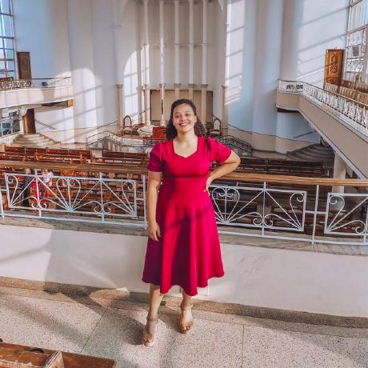

<h1 align="center"> Projeto Alura Books 📚</h1>

Ministrado por Monica Hillman, o curso <a href="https://cursos.alura.com.br/course/html-css-responsividade-mobile-first">HTML e CSS: responsividade com mobile-first</a> disponibilizado pela plataforma Alura nos permitiu desenvolver um site responsivo utilizando tecnologias avançadas, como flexbox, com foco no desenvolvimento mobile-first e adaptável em diversos dispositivos.

  <a href="#-tecnologias">Tecnologias</a>&nbsp;&nbsp;&nbsp;|&nbsp;&nbsp;&nbsp;
  <a href="#-projeto">Projeto</a>&nbsp;&nbsp;&nbsp;|&nbsp;&nbsp;&nbsp;
  <a href="#memo-licença">Licença</a>

  

 
 

 
 

## 🚀 Tecnologias

Esse projeto está sendo desenvolvido com as seguintes tecnologias:

<li> HTML
<li> CSS 
<li> Figma
<li> GitHub

## 💻 Projeto

Neste projeto tivemmos contato com muitas tecnologias e tecnicas que ampliram o nosso conhecimento. Demos inicio no projeto com a estilização do site na perspectiva de um dispositivo movel, e assim fomos evoluindo, modificando as classses para que o site ao final como um todo estivesse atendendo a maior parte dos dispositivos, fazendo dele um site responsivel.
No decorrer da aula foi realizada algumas revisões a cerca de alguns conceitos importantes, tais como: flexbox, listas, ancoras, pseudo classes e também combinadores no css.

Segue abaixo as implementações dos layouts de resposividade, seguindo o projeto desenvolvido no FIgma pela equipe da Alura:  

<li>Mobile (min-width; 428px);  
   
<li>Tablet (min-widtth: 1024px);  
   
<li>Desktop (min-width: 1728px).  
  

<!-- Para visualizar a versão atual do projeto é só<a href="https:/.github.io/alura-books/"> "Clicar aqui".</a>🚀 -->

## :memo: Licença

Este projeto está sob a licença MIT.
 

   

 <b>Eloizi❤️</b></a>

 👋 Agradeço por me visitar! Entre em contato! 💬✨

  
